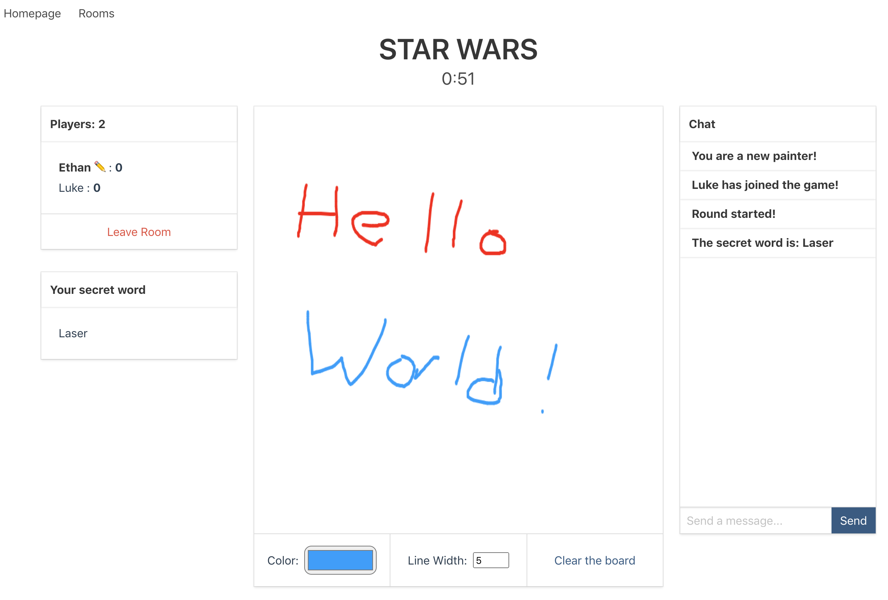

# Pictionary.io ✏️

> Traditional [pictionary](https://en.wikipedia.org/wiki/Pictionary) game moved to online experience!



## Objectives
+ The painter draw pictures which suggest the drawn word
+ The others try to guess the word to collect the most points

## How to play
1. Visit game's **[website](https://etuong.github.io/pictionary.io/#/)** 🔗
2. Create a new room or join an existing one
3. Choose your name
4. Enjoy 😊

## Development
- client folder contains frontend related artifacts
  - ```yarn serve``` runs the application
  - ```yarn build``` builds the static resources
  - ```yarn deploy``` deploys the static resources to your Github page
- server folder contains backend related files
  - ```yarn start``` kicks off the server

## Deployment
- Push server
  - If you host the socket.io server with Heroku, follow the following instruction
  - Heroku Setup
      ```
      npm install -g heroku
      heroku login
      heroku git:remote -a my-app
      git subtree push --prefix server heroku master
      ```
- Push client
  - Use your preference to host your client app. I chose Github Page for its simplicity.
  - Run ```yarn build``` and then ```yarn deploy```
  - Make sure main.js connects to your server (and not localhost)
  
### Technologies 🔧 
+ [Vue.js](https://vuejs.org/)
+ [Socket.io](https://socket.io/)

#### License ⚖️
[MIT](https://en.wikipedia.org/wiki/MIT_License)


#### Meta
Forked from Karol Waliszewski - [github](https://github.com/Karol-Waliszewski) - [karolwaliszewski@gmail.com](mailto:karolwaliszewski@gmail.com)